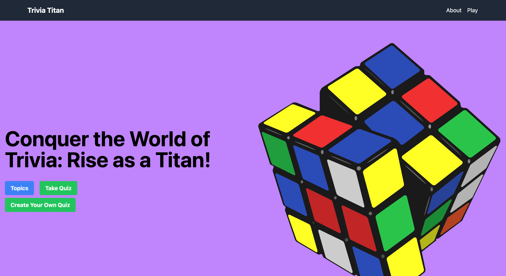

# Trivia Website - Play Fun Quizzes



Welcome to the Trivia Website, where you can have a blast answering fun quizzes on various topics. Test your knowledge and challenge your friends to see who scores the highest!

## Live Demo

Check out the live demo of the Trivia Website [here]([https://your-demo-link.com](https://trivia-site.vercel.app/)).

## Features

- Play trivia quizzes on a wide range of topics.
- Choose the number of questions and the category of the quiz.
- Select the difficulty level to suit your expertise.
- Enjoy multiple-choice questions or true/false statements.
- Interactive and user-friendly interface.
- Randomly generated questions from the Open Trivia API.
- Keep track of your scores and compete with friends.

## Technologies Used

- Vite
- React
- React Router
- Tailwind CSS

## Installation

1. Clone the repository:

   ```bash
   git clone https://github.com/your-username/trivia-website.git
   cd trivia-website
   npm install
   npm run dev
   
2. Open your browser and visit http://localhost:3000 to access the Trivia Website.
   
## API Usage

The Trivia Website uses the Open Trivia Database API to fetch random trivia questions. You can find more information about the API [here](https://opentdb.com/).

## Contributions

Contributions are welcome! If you find any bugs or have ideas for improvements, feel free to create an issue or submit a pull request.

## License

The Trivia Website is open-source and available under the [MIT License](LICENSE).

## Acknowledgements

Special thanks to the creators of the Open Trivia Database for providing the API used in this project.

